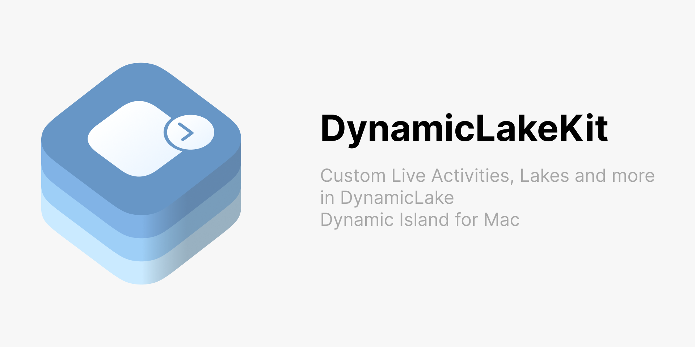

# DynamicLakeKit

<picture>
  <source media="(prefers-color-scheme: dark)" srcset="Images/DynamicLakeKit-Cover_dark.png">
  <source media="(prefers-color-scheme: light)" srcset="Images/DynamicLakeKit-Cover.png">
  
</picture>

DynamicLakeKit is the binary SDK package for building DynamicLake integrations on macOS.

Use it to build SwiftUI ExtensionKit extensions that render DynamicLake live activities, sneak peeks, extra live activities, and settings scenes. JSON plugins do not need DynamicLakeKit unless a Swift plugin executable wants to reuse the optional JSON message types.

## Swift Package Manager

Add the package in Xcode with **File > Add Package Dependencies**:

```text
https://github.com/rokach/DynamicLakeKit---Dynamic-Island-Kit-for-Mac.git
```

In another Swift package:

```swift
dependencies: [
    .package(url: "https://github.com/rokach/DynamicLakeKit---Dynamic-Island-Kit-for-Mac.git", from: "1.0.0")
]
```

Then add `DynamicLakeKit` to every target that imports it:

```swift
dependencies: [
    .product(name: "DynamicLakeKit", package: "DynamicLakeKit---Dynamic-Island-Kit-for-Mac")
]
```

DynamicLakeKit supports macOS 14 and newer.

## Extension Targets

Add the `DynamicLakeKit` product to both targets:

- The companion app target, which posts activity state with `DynamicLakeActivityCenter`.
- The ExtensionKit extension target, which renders UI with `DynamicLakeLiveActivity`, `DynamicLakeSneakPeek`, `DynamicLakeExtraLiveActivity`, and `DynamicLakeSettings`.

The extension target must use DynamicLake's extension point identifier:

```xml
<key>EXAppExtensionAttributes</key>
<dict>
    <key>EXExtensionPointIdentifier</key>
    <string>com.aviorrok.DynamicLakePro.DynamicLakePro.extension</string>
</dict>
```

## License

DynamicLakeKit is distributed under the DynamicLakeKit SDK License. You may use it to build and distribute DynamicLake integrations, but you may not modify or redistribute the SDK itself.
